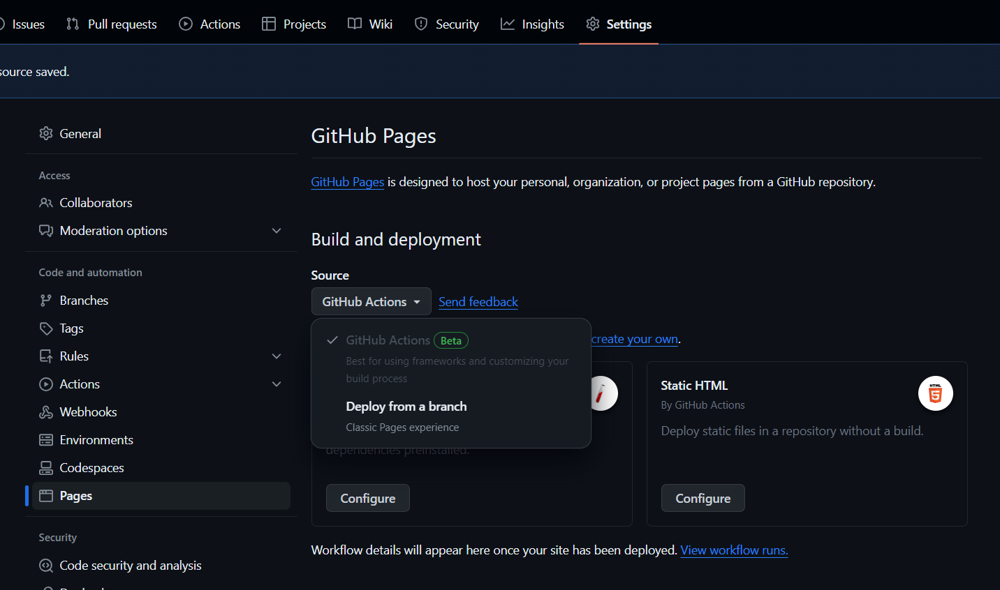

# DSC106 Final Project

This repo contains a template for a Svelte project that uses D3. It has extra
configuration to make it easy to deploy to GitHub pages.

## Getting started

Click the green "Use this template" button, then "Create a new repository" in
the top right portion of the webpage.


After GitHub completes the cloning process, navigate to the Settings page. On
the left panel, under the "Pages" tab, locate the "Source" section and select
"GitHub Actions" as the source.

Then, clone this repository to your local computer. After cloning the
repository, navigate to the repository in your terminal and run:

```
npm install
```

To start your local dev server, run

```
npm run dev
```

You can now edit your files in VSCode to see changes update in your browser.
Start by making a small edit to `src/components/App.svelte` and make sure that
the changes are reflected in your browser window.

### Including static files (e.g. datasets)

To include files like datasets and images in your project, place your files in
the `static/` folder (NOT the `src/` folder).

For example, if you have a file `static/temp.csv`, your code can load that
file by using a relative path:

```js
const res = await fetch('temp.csv');
```

Note that with our default configuration, all of these snippets **might work
locally but not on GitHub pages**:

```js
// None of these work properly
// const res = await fetch('/temp.csv');
// const res = await fetch('static/temp.csv');
```

### Using other packages (e.g. Mapbox)

To include other packages in your project, install them first by running:

```js
npm install --save moment
```

Then, you can import the packages in your Svelte JS like so:

```js
import moment from 'moment';
```

You should double check the package page to make sure you didn't miss anything
during import. For example, the web page for setting up mapbox-gl with Svelte
(https://docs.mapbox.com/help/tutorials/use-mapbox-gl-js-with-svelte/) says
that you should actually write two `import` statements:

```js
// This imports the package itself
import mapbox from 'mapbox-gl';
// This import the mapbox CSS styles
import 'mapbox-gl/dist/mapbox-gl.css';
```

## Deploying your webpage

To update your GitHub page, make a commit locally and push your changes to
GitHub. When you do so, the corresponding GitHub Actions will execute and
automatically update your static website hosted at
`https://your-username.github.io/your-repo-name` for you.



## Debugging

**My code works locally but when I push to GitHub the deployment fails.**

Run `npm run build`, which tries to replicate GitHub's build process. Ideally,
that command will give the same error message as the GitHub workflow. If so,
you can tinker with your code locally until `npm run build` works, which will
have a very high chance of fixing your build. If the command doesn't give the
same result as the GitHub workflow, make an Ed post.

**My code works locally and deploys, but nothing renders on the screen.**

Check to make sure that your static files (e.g. datasets) are loaded properly.
For example, if you have a file `static/temp.csv`, your code should load that
file by using a relative path.

If that doesn't fix your bug, open your browser's console window and see if an
error appears.
